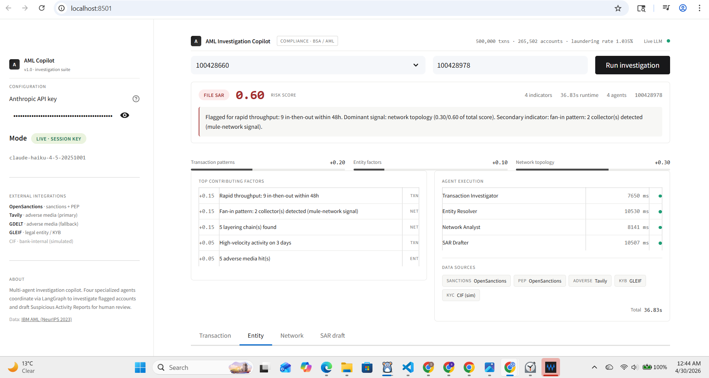
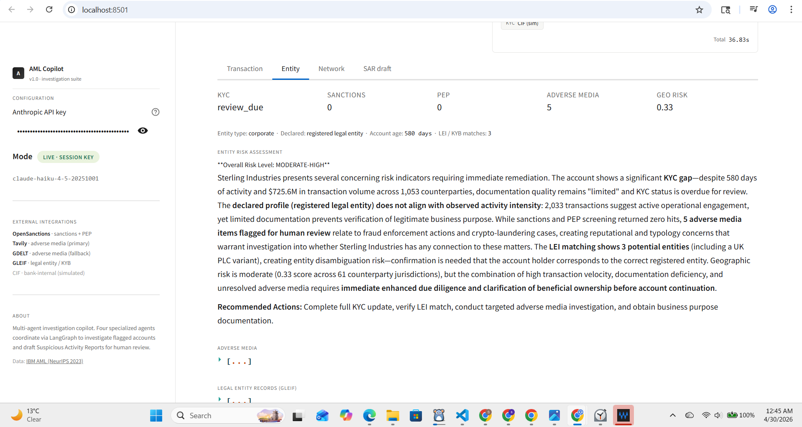
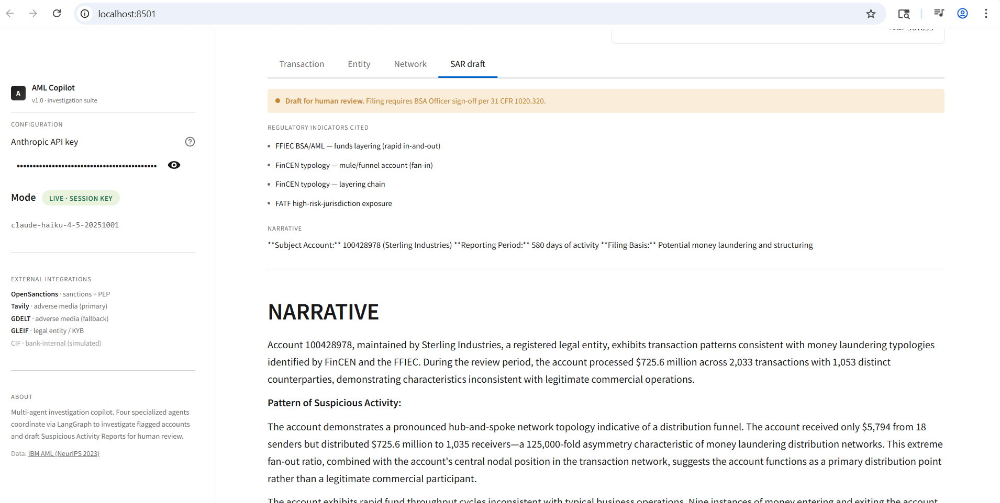

# AML Investigation Copilot

Multi-agent system for investigating flagged accounts and drafting Suspicious Activity Reports (SARs) on the IBM HI-Small AML dataset (NeurIPS 2023): 500K transactions, 265K accounts, 1.035% laundering ground truth.

Four LangGraph agents — Transaction Investigator, Entity Resolver, Network Analyst, SAR Drafter — fan out in parallel and converge on a final score plus FinCEN-style narrative. The Entity Resolver hits four real public APIs with graceful mock fallback. KYC is intentionally simulated as a bank-internal CIF lookup.



## Demo

[**Live demo →**](https://aml-copilot-srinayani.streamlit.app)

Try investigating these accounts:

| Account | Expected outcome | Why |
|---|---|---|
| `100428978` | **FILE SAR** · 0.60 risk score · corporate | Layering chains, fan-in, real GLEIF KYB lookup hits 3 LEI records |
| `100428660` | **MONITOR** · ~0.45 risk score · individual | Mid-risk profile with adverse media + KYC gap |
| `100428810` | **FILE SAR** · corporate | Different corporate account, alternate LEI matches |

## What it does

Given a flagged account, produces:

- Risk score (0–1) and recommendation: **FILE SAR**, **MONITOR**, or **NO ACTION**
- Per-agent score breakdown with top contributing factors
- FinCEN-style SAR draft citing regulatory indicators (31 CFR 1020.230, FinCEN typology codes)
- Per-source provenance — `real` if the API succeeded, `mock` if it fell back

The risk score is fully deterministic — each detected pattern adds a fixed contribution. The LLM writes prose only; it never moves the score.



## External integrations

| Component | Source | Free tier |
|---|---|---|
| Sanctions + PEP screening | [OpenSanctions](https://www.opensanctions.org/) `/match/default` | Non-commercial, key required |
| Adverse media (primary) | [Tavily AI Search](https://app.tavily.com/) | 1,000 / month, key required |
| Adverse media (fallback) | [GDELT DOC 2.0](https://api.gdeltproject.org/api/v2/doc/doc) | Unlimited, no key |
| Legal entity (KYB) | [GLEIF](https://www.gleif.org/) LEI API | Unlimited, no key |
| KYC (individual) | Simulated bank-internal CIF | — see below |

**Why KYC is mocked.** At investigation time, KYC is a CIF (Customer Information File) lookup of previously-collected onboarding data — not a fresh document/selfie verification. Public KYC APIs (Onfido, Sumsub, Didit) operate on real document images at onboarding, not on synthetic dataset accounts. The mock simulates the CIF response shape; replacing it means swapping in a bank's internal CIF service over mTLS — no agent logic changes.



## Running locally

```bash
git clone <this repo>
cd aml_copilot
python -m venv .venv && source .venv/bin/activate    # Windows: .venv\Scripts\activate
pip install -r requirements.txt
```

Download `HI-Small_Trans.csv` and `HI-Small_Patterns.txt` from [Kaggle](https://www.kaggle.com/datasets/ealtman2019/ibm-transactions-for-anti-money-laundering-aml) into `data/raw/`.

Optionally `cp .env.example .env` and add API keys (the app works in mock mode without them). Then:

```bash
streamlit run src/ui/app.py     # http://localhost:8501
pytest tests/ -v                # 31 tests
```

## Tech stack

LangGraph · Anthropic Claude (Haiku 4.5) · NetworkX · pandas · Streamlit · pytest. Python 3.13.

## Notes

No SAR is filed automatically. Every result is a draft requiring BSA Officer sign-off per 31 CFR 1020.320.

Transaction data from IBM AML (Altman et al., NeurIPS 2023) — synthetic, generated to match real laundering typologies. OpenSanctions data is [CC BY-NC 4.0](https://creativecommons.org/licenses/by-nc/4.0/).
